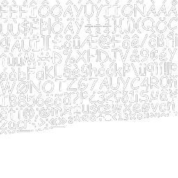
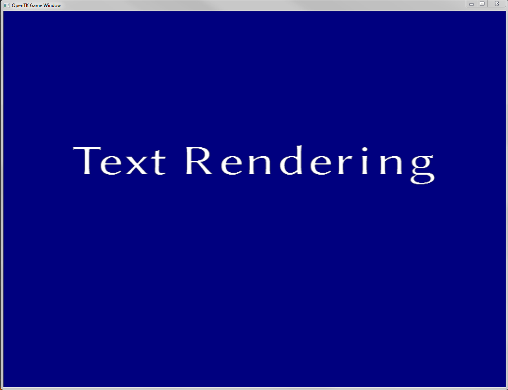

# BitmapFontLibrary

Render Bitmap fonts in your OpenTK projects.

## Features

| Feature                                | Supported          |
| -------------------------------------- | :----------------: |
| Unicode charset                        | :white_check_mark: |
| OEM charset                            | :x:                |
| Line breaks                            | :white_check_mark: |
| Kerning                                | :white_check_mark: |
| Text font files                        | :white_check_mark: |
| xml font files                         | :white_check_mark: |
| Binary font files                      | :white_check_mark: |
| png textures                           | :white_check_mark: |
| tga textures                           | :x:                |
| dds textures                           | :x:                |
| Characters packed in multiple channels | :x:                |

## How to use

This library uses Ninject for dependency injections. So get a BitmapFont object from the
BitmapFontModule and start drawing texts.

```C#
IKernel kernel = new StandardKernel(new BitmapFontModule());
_bitmapFont = kernel.Get<BitmapFont>();
_bitmapFont.Initialize("exampleFont.xml");
_bitmapFont.Draw("My text", 0.0f, 50.0f, 0.0f, 1.0f);
```

## Example

Font file used for rendering



Screenshot of rendered text



## Create your own Bitmap font

- [AngelCode Bitmap Font Generator](http://www.angelcode.com/products/bmfont/)
- [Glyphite](https://www.glyphite.com/)
